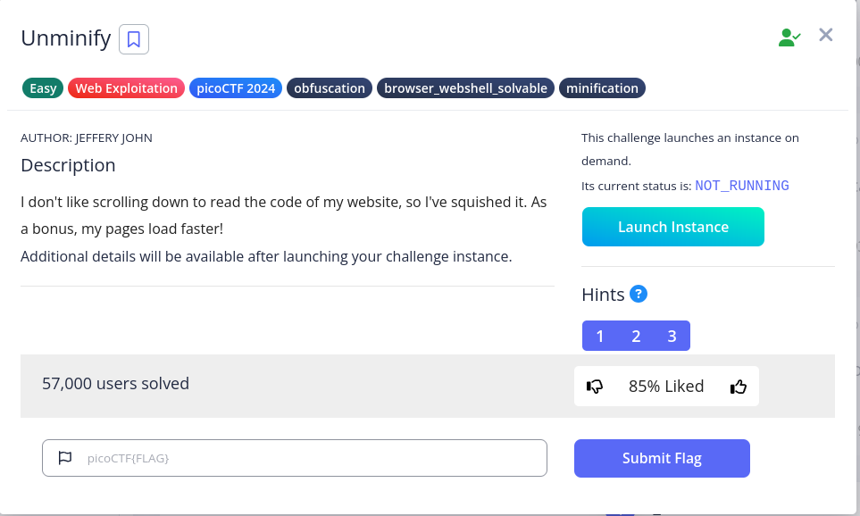
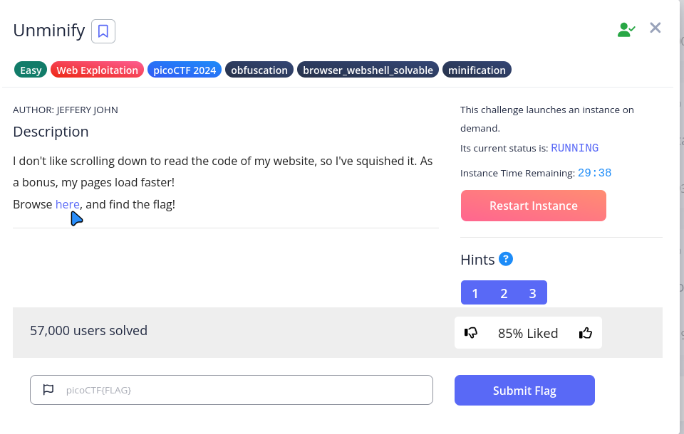
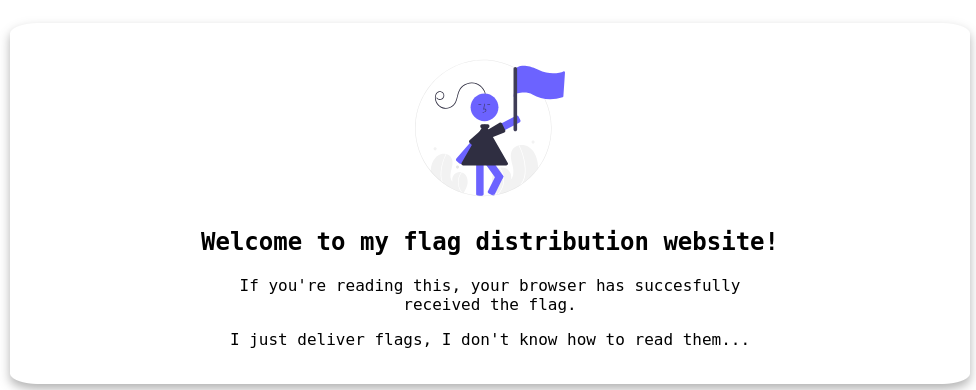
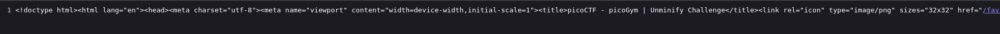
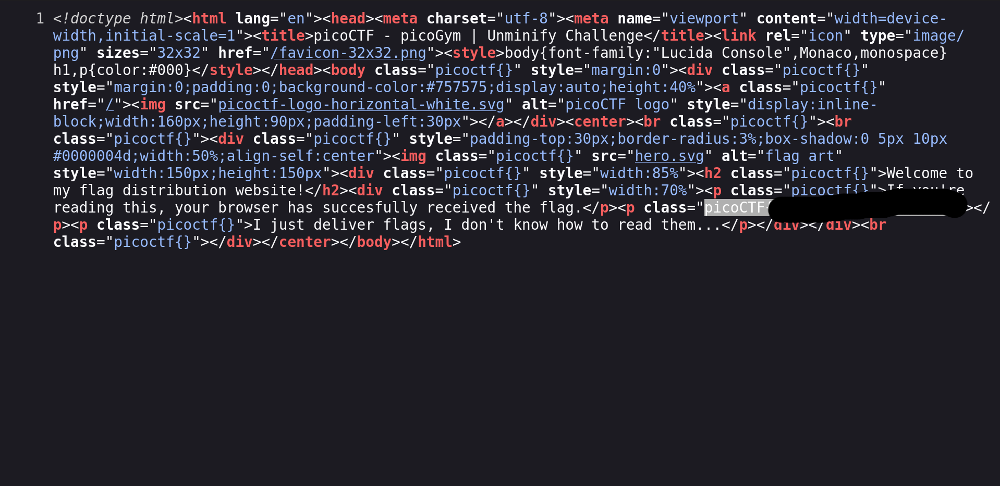

# picoCTF – Unminify [Web Exploitation] Write-Up

## 🧠 Challenge Overview

**Category:** Web Exploitation   
**Challenge Description:**

> Welcome to my flag distribution website!  
> If you're reading this, your browser has successfully received the flag.  
> I just deliver flags, I don't know how to read them...

---

## 🧩 Step-by-Step Walkthrough

### 🔹 Step 1: Launch the Challenge Instance

I began by launching the instance provided by the challenge. 
This gave me access to a hosted environment where the flag was supposedly being served.

📸 _Screenshot (optional)_  


---

### 🔹 Step 2: Access the Challenge Webpage

I clicked on the **“Click here”** link provided by the instance,
which opened a new page displaying the following message:

> Welcome to my flag distribution website!  
> If you're reading this, your browser has successfully received the flag.  
> I just deliver flags, I don't know how to read them...

📸  


---

### 🔹 Step 3: View the Page Source

Right-clicked the webpage → **"View Page Source"** (or used `Ctrl+U`) to inspect the HTML content.

📸  


---

### 🔹 Step 4: Format the Minified Code

The source revealed a long minified JavaScript block. To make it readable,
I enabled **"Wrap long lines"** in the browser source view.
This, along with syntax highlighting, helped me analyze the script more effectively.

📸  


---

### 🔹 Step 5: Analyze and Extract the Flag

After reading through the formatted HTML, I found the flag embedded in plain text:
📸  


```text
picoCTF{pr3tty_c0d3_622b2c88}

Conclusion

This challenge reinforces the importance of viewing and analyzing source code during CTFs.
 Even heavily minified or obfuscated scripts may contain valuable clues if you know where and how to look
```
